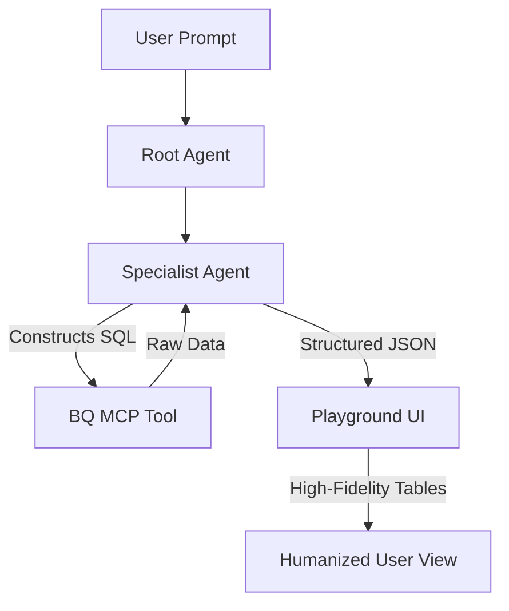

# FinOpti Platform: Architecture & Design

This document outlines the agentic architecture, data flow, and design principles of the FinOpti Google Cloud FinOps Assistant.

## 1. High-Level Architecture

FinOpti uses a hierarchical, multi-agent architecture built on the **Google Agent Development Kit (ADK)** and **Gemini 2.0/3.0 Pro**. The system decouples intelligence from application logic by shifting reasoning into specialized LLM instructions.

### Core Components

*   **Orchestration Layer**: The `Root Agent` acts as the primary gateway, performing intent detection and delegating complex tasks to specialized sub-agents.
*   **Specialist Layer**: Granular agents (e.g., `Budget Variance Agent`, `Compliance Auditor`) initialized with domain-specific instructions and SQL templates.
*   **Model Context Protocol (MCP) Layer**: Independent servers that provide tools (e.g., `BigQuery Tool`, `GCloud Tool`) to the agents without requiring the agents to manage raw connections or credentials.
*   **Structured Data Layer**: Pydantic schemas that enforce a strict contract between the LLM's reasoning and the UI's rendering.

---

## 2. The Reasoning Flow (The "Agentic Brain")

When a user submits a prompt, the system follows a dynamic reasoning path rather than a hardcoded workflow.

### Intent & Delegation
1.  **User Prompt**: "Identify good vs bad projects based on budget variance."
2.  **Intent Detection**: The **Root Agent** analyzes the prompt against its capability list.
3.  **Delegation**: The Root Agent transfers control to the **FinOps Analytics Manager**, which further routes the request to the **Budget Variance Specialist**.

### Intelligence Without Code (Prompt-Driven SQL)
The "Intelligence" of the platform resides in the **System Instructions** (`app/descandinstructions.py`).
*   Agents are provided with **SQL Templates** and **Business Logic** (e.g., "Variance > 10% is a risk") in their prompt.
*   The LLM adaptively constructs the final SQL query based on the user's specific context (e.g., filtering for a specific project or time range) without a single line of string concatenation or SQL logic in the Python codebase.

### Tool Execution (MCP)
1.  **Constructed SQL**: The Specialist Agent generates a SQL query.
2.  **Tool Call**: It invokes the `run_bq_query` tool.
3.  **MCP Interaction**: The tool call is handled by the BigQuery MCP server, which executes the query against the GCP project and returns raw JSON data.

---

## 3. Data Flow & Rendering Mapping

The platform ensures a professional experience by strictly managing how data travels from the LLM to the UI using **Structured Outputs**.

### Structured Contracts
The system uses Pydantic models (in `app/schemas.py`) to enforce the LLM's output format.
*   **Constraint**: The `BudgetVarianceResult` model ensures that the LLM provides a list of objects with specific types (strings for names, floats for costs).
*   **Benefit**: This eliminates the `additionalProperties` errors and allows the UI to reliably parse the result.

### UI Intelligent Rendering
The **Playground UI** (`app/playground.py`) contains a schema-aware rendering engine:
*   **Detection**: It inspects the agent's output for specific FinOps keys (e.g., `projects_at_risk`).
*   **Transformation**: It automatically converts the JSON metadata into **Streamlit Tables**, **Plotly Charts**, or **Alert Boxes**, ensuring a "Premium" first impression.

---

## 4. Key Design Principles

1.  **Failure is Data**: Every error is captured and used by the agent to "pivot" or retry (Reflect & Retry pattern).
2.  **Humanization Protocol**: Raw JSON is strictly forbidden in user-facing responses. The Root Agent is mandated to translate technical specialist data into professional summaries.
3.  **Regional Awareness**: Instructions explicitly include GCP region and zone details (Iowa, us-central1) to ensure the LLM makes context-aware recommendations.
