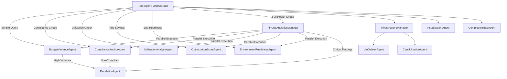

# Granular Agentic Strategy for FinOpti Platform (v3: Refined with Optimizations)

## 1. Executive Summary
We are moving from a "Monolithic Root" to a **Hybrid Hierarchical Multi-Agent System**. This approach combines the benefits of specialized agents with optimized routing to minimize latency while maximizing maintainability.

This strategy incorporates critical improvements including:
- Structured output schemas for reliable agent communication
- Hybrid flat+hierarchical routing for performance optimization
- Comprehensive error handling and validation
- Clear data schema requirements

---

## 2. High-Level Architecture

The system supports **two routing modes**:

### 2.1 Flat Routing (Default)
For single-task queries, the Root routes directly to specialists:
```text
Root → BudgetVarianceAgent → Tool (2 LLM hops)
```

### 2.2 Hierarchical Routing (Bulk Operations)
For comprehensive reports, the Root delegates to a Manager:
```text
Root → FinOpsAnalyticsManager → [Multiple Specialists] → Aggregation (3 LLM hops)
```

**Architecture Layers:**
1.  **Level 1: The Orchestrator (Root)** - Routes based on query complexity
2.  **Level 2: Domain Managers** (Optional) - Coordinate multi-specialist workflows
3.  **Level 3: Specialist Agents** - Perform atomic, focused tasks

---

## 3. The FinOps Analytics Division

### 3.1. Specialist Agents (Level 3)

All specialists use **structured output schemas** for reliable communication.

#### A. `BudgetVarianceAgent`
*   **Mission:** "Follow the Money"
*   **Task:** Compare budgeted vs. actual costs
*   **Data Sources:** `release_train_ticket`, `finops_cost_usage`
*   **Output Schema:**
    ```python
    class BudgetVarianceResult(BaseModel):
        projects_at_risk: list[dict]  # [{project_name, variance_pct, budgeted, actual}]
        variance_threshold: float = 0.10
        total_projects_analyzed: int
        severity: Literal["low", "medium", "high"]
    ```
*   **SQL Query (Example):**
    ```sql
    SELECT 
        f.project_name,
        r.budget_approved as budgeted_cost,
        SUM(f.monthly_cost) as actual_cost,
        ((SUM(f.monthly_cost) - r.budget_approved) / r.budget_approved) * 100 as variance_pct
    FROM `vector-search-poc.finoptiagents.finops_cost_usage` f
    JOIN `vector-search-poc.finoptiagents.release_train_ticket` r 
        ON f.project_name = r.project_name
    GROUP BY f.project_name, r.budget_approved
    HAVING ABS(variance_pct) > 10
    ```

#### B. `ComplianceAuditorAgent`
*   **Mission:** "Enforce the Rules"
*   **Task:** Identify rogue projects
*   **Output Schema:**
    ```python
    class ComplianceResult(BaseModel):
        non_compliant_projects: list[str]
        violation_type: Literal["missing_from_release_train", "missing_from_earb", "both"]
        recommended_actions: list[str]
        severity: Literal["low", "medium", "high", "critical"]
    ```
*   **SQL Query (Example):**
    ```sql
    SELECT DISTINCT f.project_name
    FROM `vector-search-poc.finoptiagents.finops_cost_usage` f
    LEFT JOIN `vector-search-poc.finoptiagents.release_train_ticket` r 
        ON f.project_name = r.project_name
    LEFT JOIN `vector-search-poc.finoptiagents.earb_review` e 
        ON f.project_name = e.project_name
    WHERE r.project_name IS NULL OR e.project_name IS NULL
    ```

#### C. `UtilizationAnalystAgent`
*   **Mission:** "Efficiency Check"
*   **Task:** Analyze environment cost ratios and resource utilization
*   **Output Schema:**
    ```python
    class UtilizationResult(BaseModel):
        anomalous_environments: list[dict]  # [{project, prod_cost, lower_env_cost}]
        low_utilization_resources: list[dict]  # [{resource_id, utilization_pct, cost}]
        total_potential_savings: float
    ```
*   **Logic:**
    -   **Env Check:** `Cost(Lower Env) > Cost(Production)` → Flag as anomaly
    -   **Resource Check:** `Utilization < 50%` → Flag for review

#### D. `OptimizationScoutAgent`
*   **Mission:** "Find Savings"
*   **Task:** Identify top wasteful spenders
*   **Output Schema:**
    ```python
    class OptimizationResult(BaseModel):
        top_cost_contributors: list[dict]  # [{resource_type, cost, utilization, savings_potential}]
        optimization_candidates: list[str]
        estimated_monthly_savings: float
    ```
*   **Categories:** Compute, Storage, Managed DBs, Network Egress, Logging/Monitoring

#### E. `EnvironmentReadinessAgent`
*   **Mission:** "Justify Existence"
*   **Task:** Verify lower environments have active justification
*   **Output Schema:**
    ```python
    class ReadinessResult(BaseModel):
        zombie_environments: list[dict]  # [{env_name, cost, days_idle, active_tickets}]
        justified_environments: list[str]
        total_zombie_cost: float
    ```
*   **Integrations:** Release Train Tickets, ServiceNow CR/Defects APIs
*   **Rule:** Lower Env with NO active tickets/releases → "Zombie Environment"

### 3.2. `FinOpsAnalyticsManager` (Level 2)

> [!IMPORTANT]
> **Role Clarification**
> The Manager is a **Smart Aggregator**, not a simple router. It coordinates multiple specialists and synthesizes their findings into executive summaries.

*   **When to Use:** User requests like "Run full FinOps health check" or "Generate quarterly report"
*   **Tools:** `combine_analysis_results` (custom aggregation tool)
*   **Workflow:**
    1.  Run all 5 specialists in parallel (using `ParallelAgent`)
    2.  Collect structured outputs (Pydantic models)
    3.  Synthesize into a unified report
    4.  Hand off to `EscalationAgent` if critical issues found
*   **Output Schema:**
    ```python
    class FinOpsHealthReport(BaseModel):
        budget_summary: BudgetVarianceResult
        compliance_summary: ComplianceResult
        utilization_summary: UtilizationResult
        optimization_summary: OptimizationResult
        readiness_summary: ReadinessResult
        overall_health_score: float  # 0-100
        critical_actions_required: list[str]
    ```

---

## 4. The Action & Escalation Division

### `EscalationAgent` (Level 2)
*   **Role:** The "Fixer" - Converts findings into actions
*   **Tools:** `create_servicenow_cr`, `send_email`, `trigger_earb_review`
*   **Input:** Structured analysis results (Pydantic models)
*   **Workflows:**
    -   **ServiceNow CR Creation:** Bulk create CRs for non-compliant projects
    -   **Executive Alerts:** Draft emails with summaries for leadership
    -   **EARB Scheduling:** Propose review meetings for high-risk projects

---

## 5. Updated Agent Hierarchy Diagram



---

## 6. Critical Implementation Requirements

### 6.1 Data Schema Documentation (Phase 0 - MANDATORY)

> [!CAUTION]
> **Do not proceed to implementation without completing this phase.**

Before creating any agents, document the exact schemas of all tables:

| Table | Required Columns | Example Values | Notes |
|-------|------------------|----------------|-------|
| `release_train_ticket` | `project_name`, `budget_approved`, `planned_release_date` | "project-alpha", 50000.00, "2025-Q1" | Stores approved budgets |
| `finops_cost_usage` | `project_name`, `month`, `monthly_cost`, `resource_type`, `resource_utilization_percent` | "project-alpha", "2025-01-01", 45000.00, "compute", 65.0 | Actual spend data |
| `earb_review` | `project_name`, `review_status`, `approval_date` | "project-alpha", "approved", "2024-12-01" | Architecture review status |
| `vm_deletion_log` | `log_data` (JSON) | See existing schema in `descandinstructions.py` | Deletion audit trail |

**Action Item:** Create a `data_schemas.md` document with full DDL statements and sample data.

### 6.2 SQL Query Validation (Phase 0.5)

1.  Write all specialist SQL queries in a `queries/` directory
2.  Validate against actual BigQuery tables
3.  Test with real data to ensure no syntax errors
4.  Measure query performance (<3 seconds for all queries)

### 6.3 Error Handling & Fallbacks

All specialists must implement:

```python
class AgentErrorResponse(BaseModel):
    error_type: Literal["data_unavailable", "query_failed", "api_timeout"]
    error_message: str
    fallback_executed: bool
    partial_results: Optional[dict] = None
```

**Fallback Strategies:**
- **BigQuery Timeout:** Return cached results from last successful run
- **Missing Table:** Skip that analysis and note in error response
- **Conflicting Data:** Flag for manual review, continue with other checks

### 6.4 Performance Optimization

1.  **Data Caching:**
    -   Implement a `DataCache` service that stores BigQuery results for 5 minutes
    -   Specialists check cache before running queries
    -   Reduces redundant calls when multiple specialists need same data

2.  **Parallel Execution:**
    -   Use `ParallelAgent` for the FinOpsAnalyticsManager's specialist calls
    -   Reduces total execution time from 15s (sequential) to 3-5s (parallel)

3.  **Lazy Evaluation:**
    -   Only run specialists that are relevant to the user's query
    -   Example: "Check budget variance" should NOT trigger EnvironmentReadinessAgent

---

## 7. Implementation Roadmap (Refined)

### Phase 0: Foundation (CRITICAL - 3-5 days)
1.  **Schema Documentation:** Document all BigQuery table schemas
2.  **SQL Development:** Write and validate all specialist queries
3.  **Output Schema Design:** Define all Pydantic models

### Phase 1: Core Specialists (1-2 weeks)
1.  Implement `BudgetVarianceAgent` and `ComplianceAuditorAgent` (highest priority)
2.  Add comprehensive logging and error handling
3.  Test with production-like data

### Phase 2: Additional Specialists (1 week)
1.  Implement `UtilizationAnalystAgent`, `OptimizationScoutAgent`, `EnvironmentReadinessAgent`
2.  Integrate with external APIs (ServiceNow, Release Train system)

### Phase 3: Manager & Aggregation (1 week)
1.  Create `FinOpsAnalyticsManager` with `ParallelAgent` workflow
2.  Implement `combine_analysis_results` tool
3.  Test bulk operations

### Phase 4: Escalation & Actions (1 week)
1.  Implement `EscalationAgent` with ServiceNow and Email tools
2.  Create approval workflows for destructive actions

### Phase 5: Integration & Optimization (1 week)
1.  Wire specialists to Root with hybrid routing logic
2.  Implement data caching layer
3.  Performance testing and optimization

---

## 8. Compliance & Security Division

### 8.1 `VmDeletionAuditorAgent`

> **Added:** December 2025

*   **Role:** "The Auditor"
*   **Capabilities:**
    -   Query VM deletion history from BigQuery logs
    -   Parse double-encoded JSON in `log_data` column
    -   Answer compliance questions: "Who deleted what and when?"
*   **Tools:**
    -   `run_bq_query` (specialized SQL for nested JSON parsing)
*   **Output Schema:**
    ```python
    class VmDeletionAuditResult(BaseModel):
        deleted_vms: list[dict]  # VM details with deletion metadata
        total_deletions: int
        query_timeframe: str
        queried_user: Optional[str] = None
    ```
*   **Data Source:** `vector-search-poc.finops_agent_logs.vm_deletion_log`
*   **Key Features:**
    -   Double-JSON parsing pattern for nested log data
    -   Case-insensitive user search
    -   Safe timestamp handling with `SAFE.PARSE_TIMESTAMP`
    -   5 pre-built SQL queries for common audit scenarios

**Common Queries:**
-   "Who deleted the last VM?"
-   "How many VMs were deleted today?"
-   "Show all VMs deleted by [user]"
-   "When did [user] delete VMs?"

---

## 9. Benefits of This Refined Strategy

| Benefit | Impact | How It's Achieved |
|---------|--------|-------------------|
| 🎯 **Precision** | High | Each specialist has ONE focused mission with structured outputs |
| ⚡ **Performance** | High | Hybrid routing + parallel execution + caching = <5s responses |
| 🔍 **Debuggability** | High | Pydantic schemas + structured errors = easy troubleshooting |
| 📊 **Reliability** | High | Mandatory schema validation + SQL testing before deployment |
| 🔧 **Extensibility** | High | Add new specialists without touching existing code |
| 💰 **Cost Efficiency** | Medium | Flat routing reduces unnecessary LLM calls |

---

## 9. Risk Mitigation

| Risk | Impact | Mitigation |
|------|--------|------------|
| **SQL Injection** | High | Use parameterized queries via BigQuery API |
| **Schema Changes** | Medium | Implement schema versioning and automated tests |
| **API Rate Limits** | Medium | Add exponential backoff and caching |
| **Agent Hallucination** | High | Force structured outputs via `output_schema`, never freeform responses |
| **Performance Degradation** | Medium | Monitor latency per agent; alert if >5s |

---

## 10. Logging & Observability

To ensure deep visibility into agent performance and behavior, we utilize a centralized logging strategy aligned with Google ADK standards.

### 10.1 Centralized Configuration
Logging is configured via `app/utils/logging_config.py`. This module provides a `setup_logging()` function that must be called at the start of every entry point (`run_agent.py`, `app/playground.py`, `mcp_server/main.py`).

### 10.2 Configuration & Log Levels
Control log verbosity using the `LOG_LEVEL` environment variable.

| Level | Usage | Behavior |
|-------|-------|----------|
| `INFO` | **Production (Default)** | Captures high-level agent lifecycle events, tool executions, and final responses. |
| `DEBUG` | **Development** | Captures full prompt/response payloads, raw internal state, and detailed debug triggers. **Review for PII.** |

### 10.3 Hybrid Telemetry
-   **Standard Logging (Stdout):** Used for immediate, human-readable operator logs using standard Python `logging`.
-   **Cloud Trace (Telemetry):** Structured telemetry (spans, traces) is exported to Google Cloud Trace via `app/utils/tracing.py` for performance analysis.

---

## 11. Success Metrics

- **Response Time:** <5s for single-specialist queries, <10s for full health checks
- **Accuracy:** >95% SQL query success rate
- **Reliability:** Zero unhandled exceptions in production
- **Token Efficiency:** Hybrid routing uses ≤150% tokens vs. monolithic design
- **User Satisfaction:** Findings are actionable and lead to measurable cost savings

---

## 12. Alternative Considered: Fully Flat Architecture

**Pros:** Fastest response time (2 LLM hops), simplest routing logic  
**Cons:** No bulk operation support, Root agent's description becomes bloated with 12+ sub-agents

**Decision:** Use hybrid approach to get benefits of both architectures.

---

## 13. Next Steps

1.  ✅ Strategy approved → Proceed to Phase 0
2.  📝 Assign engineer to schema documentation
3.  🧪 Set up BigQuery sandbox for SQL testing
4.  📅 Schedule weekly reviews during implementation
